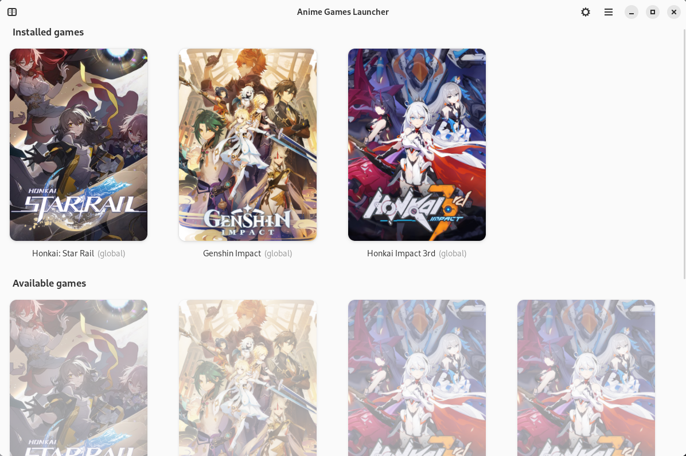
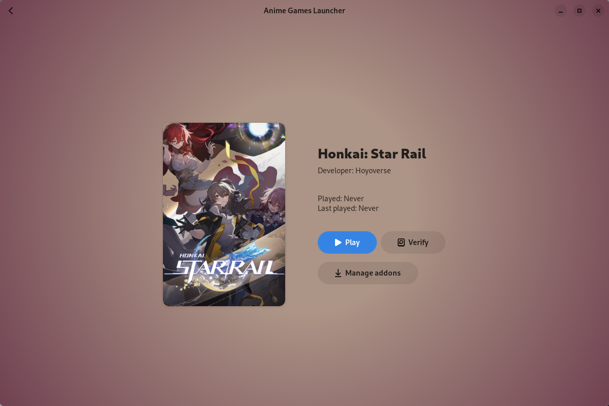

| Main window | Game details |
| :-: | :-: |
| <picture><source media="(prefers-color-scheme: dark)" srcset="repository/main-dark.png"></picture> | <picture><source media="(prefers-color-scheme: dark)" srcset="repository/details-dark.png"></picture> |

<p align="center">
    <a href="https://discord.gg/ck37X6UWBp">Discord</a> ·
    <a href="https://matrix.to/#/#an-anime-game:envs.net">Matrix</a>
</p>

<p align="center">Universal linux launcher for anime games</p>

<br>

# ♥️ Useful links and thanks

* [macOS launcher](https://github.com/3Shain/yet-another-anime-game-launcher) which contains some additional compatibility components
* [Releases page](https://github.com/an-anime-team/anime-games-launcher/releases) where you can find latest available version
* [Changelog](CHANGELOG.md) with chronology of the project
* [Integration guide](GAMES_INTEGRATION.md) with games integration standard

<br>

# 💻 Development

| Folder | Description |
| - | - |
| src | Rust source code |
| assets | App assets folder |
| target/release | Release build of the app |

## Clone repo

```sh
git clone https://github.com/an-anime-team/anime-games-launcher
```

## Run app

```sh
cargo run
```

## Build app

```sh
cargo build --release
```
