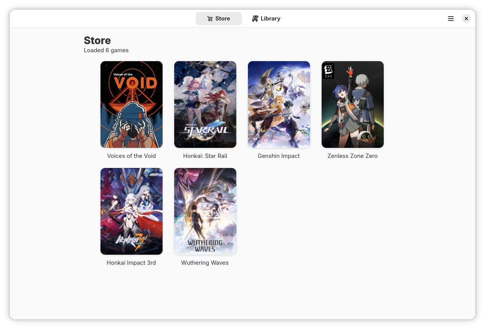
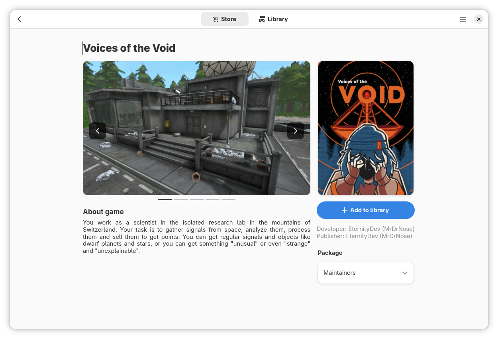
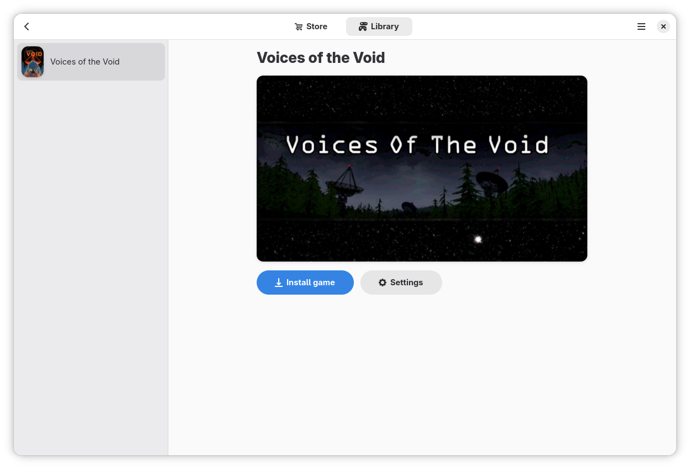
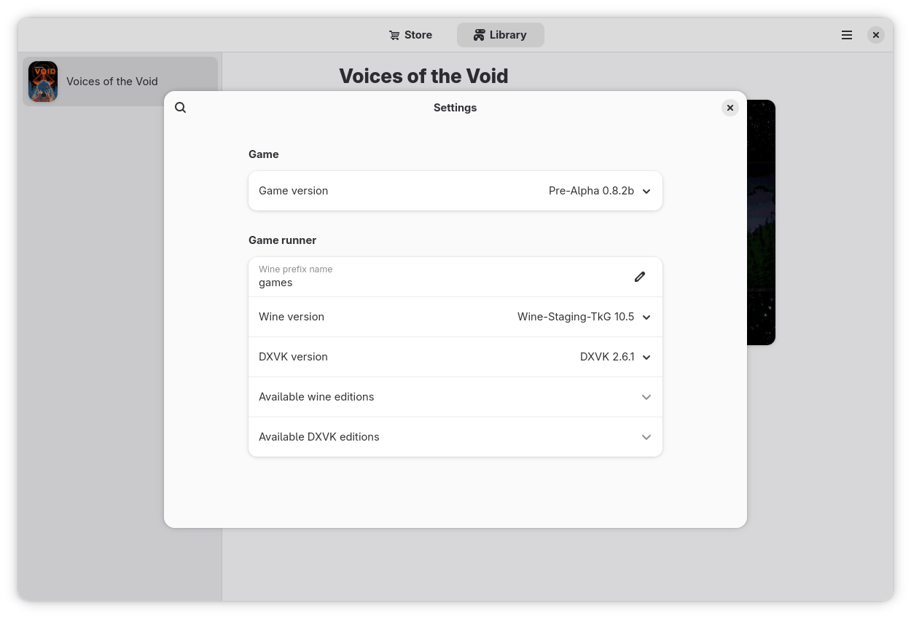

   

<table>
   <tr>
      <th align="center">
         
         
Store page

      </th>
      <th align="center">
         
         
Game details

      </th>
   </tr>
   <tr>
      <th align="center">
         
         
Library page

      </th>
      <th align="center">
         
         
Game settings

      </th>
   </tr>
</table>

   <a href="https://discord.gg/ck37X6UWBp" target="_blank">Discord</a> /
   <a href="https://zulip.dawn.wine" target="_blank">Zulip</a> /
   <a href="https://github.com/an-anime-team/game-integrations" target="_blank">Game integrations</a> /
   <a href="./repository/The Anime Games Launcher Developer Handbook.pdf" target="_blank">Developer Handbook</a>

**Anime Games Launcher** is a fully community powered games launcher. It 
provides a packages manager and special lua scripts runtime which can be used
by external contributors to add games into the launcher.

If you want to add a game support to this launcher - please start by reading
[The Anime Games Launcher Developer Handbook](./repository/The%20Anime%20Games%20Launcher%20Developer%20Handbook.pdf),
then follow the useful links to read up-to-date documentation.

## Installation

We're currently not planning to expand the distributions support since the
launcher, while being functional, lacks community support for different games.
We will work on wider distributions support once more games will be supported.

| Package                                                            | Distributions                                   |
| ------------------------------------------------------------------ | ----------------------------------------------- |
| [Flatpak](https://github.com/an-anime-team/agl-flatpak)            | Fedora Workstation, etc.                        |
| [AUR](https://aur.archlinux.org/packages/anime-games-launcher-bin) | Arch Linux, CachyOS, Manjaro, EndeavourOS, etc. |

## Useful links

- [Packages manager documentation](./crates/agl-packages/README.md)
- [Luau runtime documentation](./crates/agl-runtime/docs/README.md)
- [Game integrations documentation](./crates/agl-games/README.md)
- [Game integrations repository](https://github.com/an-anime-team/game-integrations)
- [Launcher localization files](./crates/anime-games-launcher/assets/locales)
- [Standard i18n package localization files](https://github.com/an-anime-team/game-integrations/tree/master/packages/i18n/locales)

 

The whole project and all its components listed in this repo are licensed 
under [GPL-3.0-or-later](./LICENSE)
